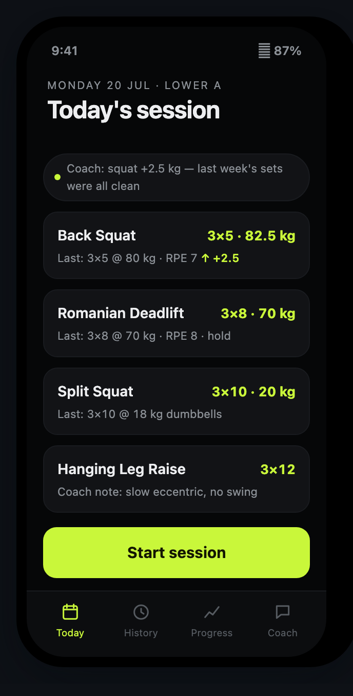
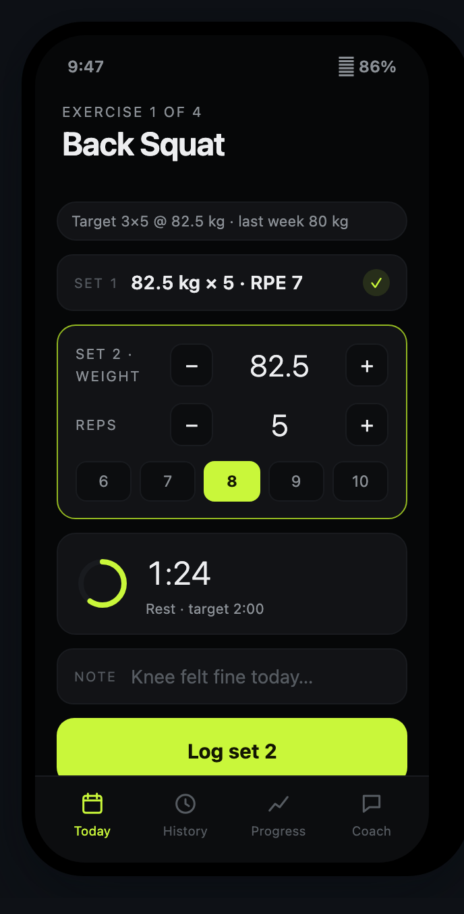
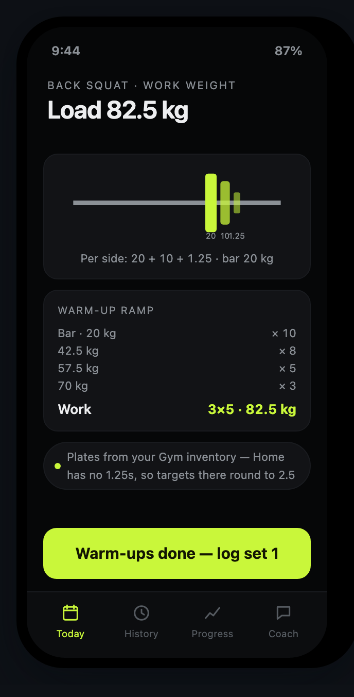
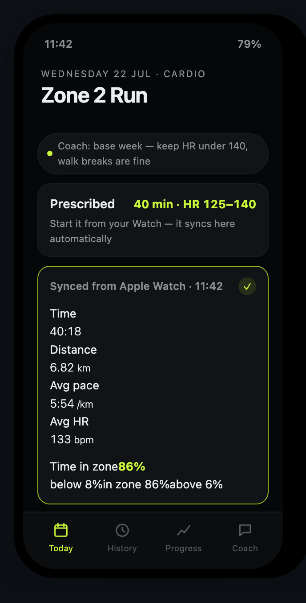
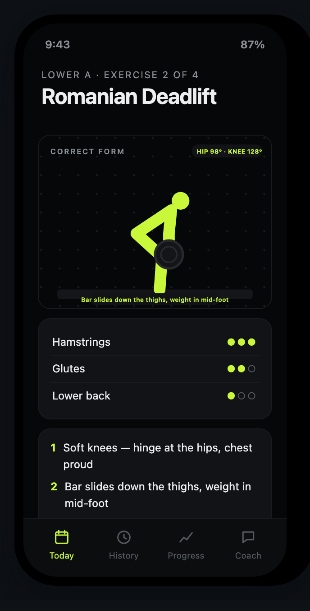
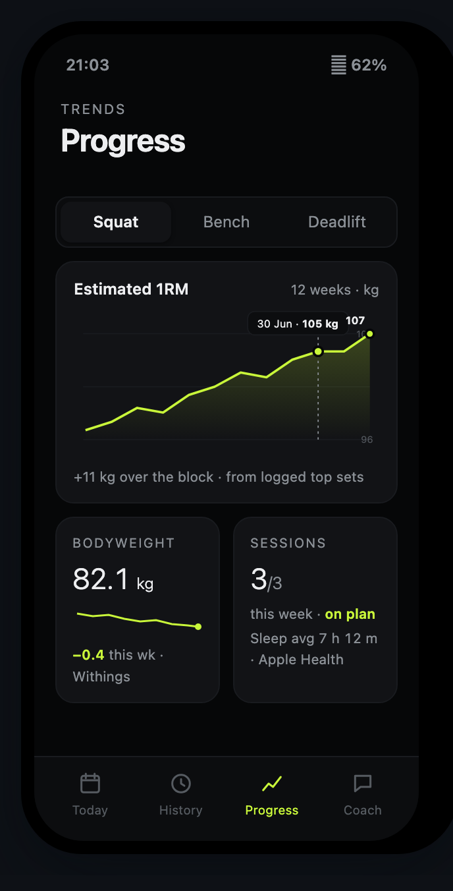
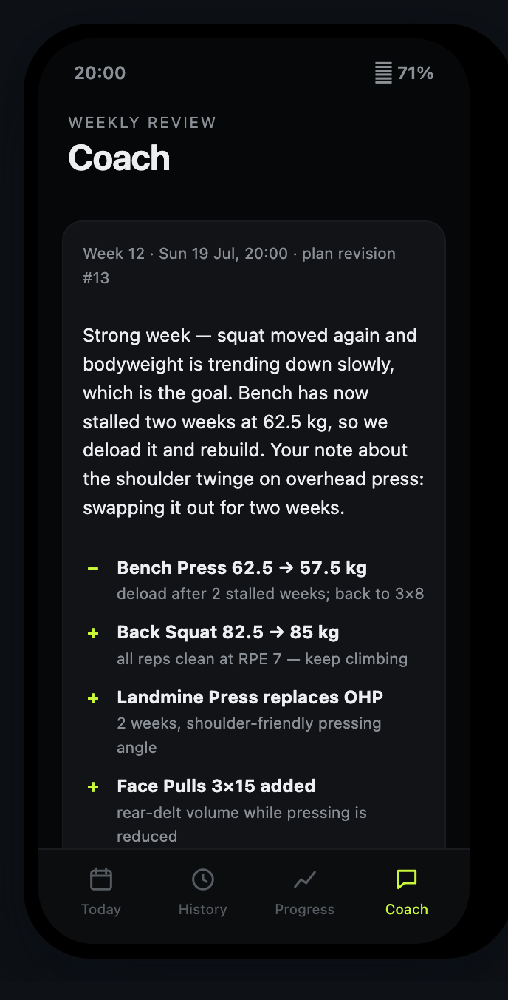
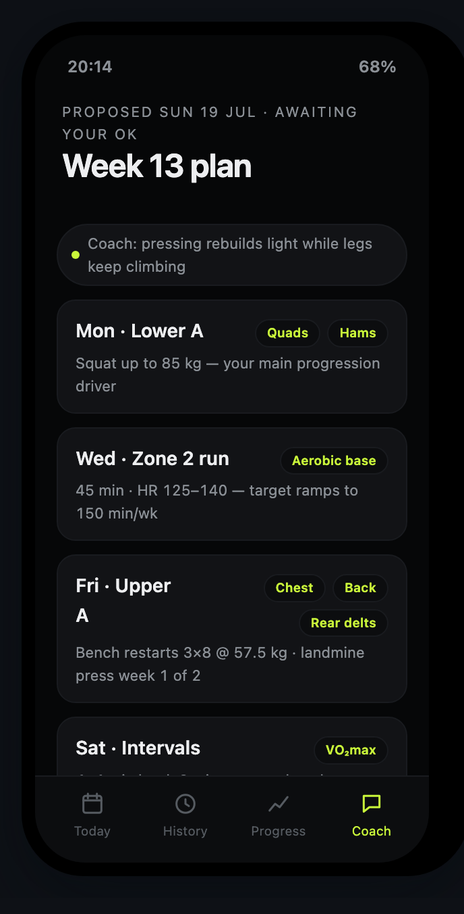
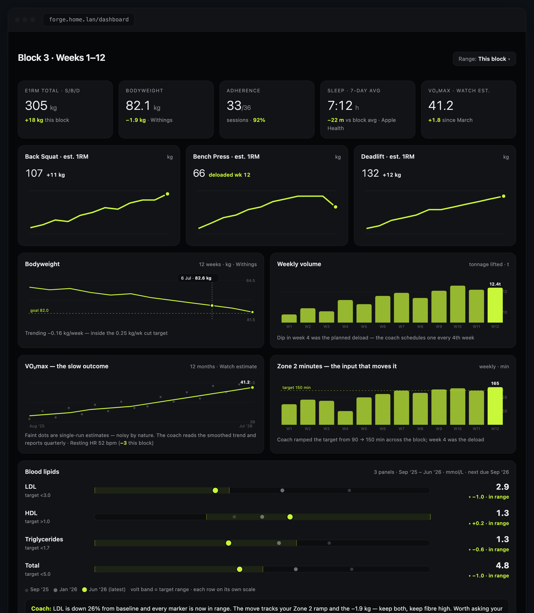

# Forge

Self-hosted, agent-coached fitness tracker for two. FastAPI + Postgres + a vanilla-JS PWA,
one Docker Compose stack. Design docs: [docs/](docs/) · visual spec, clickable demo and build
docs are linked from `docs/implementation-plan.md`.

**Status: Phase 4 of the [implementation plan](docs/implementation-plan.md) complete.**

## What it does

**Training plans with time-budget fitting.** Each user has a weekly plan (strength +
cardio days) shown as a rolling 7-day view starting today. Before a session you say how
long you actually have; the fitting engine trims the session to fit — the priority-1 main
lift is never touched, accessories trim first down to their minimum sets, and the cooldown
shortens from 5 to 2 minutes but is never dropped. Any strength day can be pulled onto
today if life reshuffles the week.

**A complete logging flow.** Warm-up ramp generation, kg plate math for barbell loads,
rest timer, in-session exercise swaps (filtered by your equipment profile), cool-down
checklist. Sets log to an IndexedDB offline queue first, so a dead Wi-Fi corner of the
garage never loses a set — the queue flushes when the connection returns. PRs and
records, per-exercise history, and progress charts build up from there.

**Apple Health in, automatically.** Health Auto Export POSTs to `/ingest` with a
per-user bearer token: weight, sleep, resting HR, VO2 max, and workouts. Ingest is
idempotent and unit-aware (pounds convert on arrival; storage is always kg). Withings
scales can also connect directly via OAuth + webhooks, no phone in the loop.

**Cardio reconciliation.** Watch workouts that arrive via ingest are matched against the
planned cardio day: matched sessions complete the plan with target-vs-actual duration and
% of time in the prescribed HR zone; unmatched ones are kept as unplanned. Weekly Zone-2
minutes accumulate against a fixed 110–145 bpm band.

**A Claude coach.** Chat with a server-side coach agent that can read your training and
health data through the same route handlers the app uses (strictly scoped to your user).
Every Sunday evening it runs a weekly review and proposes next week's plan as a
structured revision — a delta list of changes plus a one-line "why" per day — which you
approve or reject in-app (or set auto-apply). Proposals are validated server-side before
they can ever touch a plan. Token spend is logged per run.

**The rest.** Onboarding wizard, labs tracking (lipids etc., stored mmol/L), niggle/pain
tracking that the coach factors in, equipment profiles, exercise library with curated
form photos, data export, a desktop dashboard at `/dashboard`, and web push (proposal
alerts + a once-daily workout reminder inside a 16:00–21:00 window). Per-user display
units (lb/kg, with per-exercise overrides) over always-canonical metric storage.
Installable PWA, hand-written design system, exactly two users by design — every row is
user-scoped and the allowlist is the whole auth model.

## Mockups

> **These are design mockups, not live screenshots** — Forge is in active development.
> They're concept renders from the visual spec the app is being built against; the shipped
> screens track them closely. The full set (33 screens, including onboarding, settings and
> a light-theme variant) is in [docs/mockups/](docs/mockups/).

| | | | |
|---|---|---|---|
|  |  |  |  |
| Today's session | Set-by-set logging | Plate math + warm-ups | Zone-2 reconciliation |
|  |  |  |  |
| Exercise form guide | Progress trends | Weekly coach review | Plan proposal to approve |

The desktop dashboard (`/dashboard`, same server):



## Fresh install on a new server

```bash
git clone <this repo> forge && cd forge
ALLOWED_USERS="you@example.com:You,her@example.com:Her" ./deploy/fresh-install.sh
```

The script writes the generated secrets into `docker-compose.override.yml` (gitignored —
the tracked compose carries placeholders only), builds and starts the stack, generates
VAPID push keys, and health-checks it. Clean database — users, exercise library, starter
plans and equipment profiles are seeded on first boot; do onboarding in the app.

Only the essentials live in compose. After first boot, the admin manages the rest in-app
under **Settings → Server**: the Anthropic API key and coach model, Withings API
credentials, web-push key generation, and both user accounts (names, sign-in emails,
adding the second seat). App-managed values are stored in the database, override the
compose environment, and apply live — no restart. Google OAuth is the one exception: it
has to exist before anyone can sign in, so it stays in compose.

To set up by hand instead: edit the values at the top of [docker-compose.yml](docker-compose.yml)
(`POSTGRES_PASSWORD` in both places, `SESSION_SECRET`, your `ALLOWED_USERS` emails), then

```bash
docker compose up -d          # pulls ghcr.io/lemmy-winks/forge:latest
open http://localhost:33524
```

The main compose file is deliberately image-only so it can be pasted into Portainer as-is.
To build from source instead of pulling, layer on the build add-on:

```bash
docker compose -f docker-compose.yml -f docker-compose.build.yml up -d --build
```

### Deploy with Portainer

Every push to `main` publishes a ready-built multi-arch image to
`ghcr.io/lemmy-winks/forge:latest` (GitHub Actions), so Portainer never needs to build
anything: **Stacks → Add stack → Web editor**, paste [docker-compose.yml](docker-compose.yml),
and edit the `change-me` values and `ALLOWED_USERS` right in the editor before deploying.

While the repo is private its image is too — either make the package public
(GitHub → Packages → forge → settings → visibility), or give Portainer pull access:
**Registries → Add registry** → `ghcr.io`, your GitHub username, and a PAT with
`read:packages`.

After the first deploy, sign in as the admin and finish setup in **Settings → Server**
(coach API key, Withings credentials, push keys, the second user's real email) — none of
that needs a redeploy.

With no Google credentials configured, the sign-in page shows **dev sign-in buttons** for the
allowlisted users — fine on your LAN, do not expose publicly like that. The database schema
and seed data (exercise library, starter plan per user, equipment profiles) are created on
first boot; everything persists in the `pgdata` volume.

### Google sign-in (when you're ready)

1. Google Cloud Console → OAuth consent screen (External, add both emails as test users).
2. Create OAuth client (Web application), authorized redirect URI: `https://your-domain/auth/callback`.
3. Put the client ID/secret + your public `BASE_URL` in the compose environment
   (override file or Portainer editor), `docker compose up -d`.

### Apple Health in (Health Auto Export)

1. In the app: Settings → Connections → **ROTATE** to mint your token, copy it.
2. Health Auto Export → Automations → REST API:
   - URL: `https://your-domain/ingest` (or `http://<host-ip>:33524/ingest` on the LAN)
   - Header: `Authorization: Bearer <token>`
   - Format JSON; select weight, sleep, resting HR, VO2 max, workouts.
3. Run it once manually — Connections should show "Live · n samples" within a minute.

Withings: link Withings → Apple Health sync in the Withings app for now; direct OAuth comes in Phase 4.

### Ingress (your existing chain)

Cloudflare DNS → VPS Nginx → Tailscale → this box. Nginx site:

```nginx
server {
  listen 443 ssl http2;
  server_name forge.yourdomain.com;
  # ... your existing TLS config ...
  location / {
    proxy_pass http://<tailscale-ip-of-host>:33524;
    proxy_set_header Host $host;
    proxy_set_header X-Forwarded-Proto https;
    proxy_set_header X-Forwarded-For $remote_addr;
  }
}
```

Set `BASE_URL=https://forge.yourdomain.com` so session cookies are marked Secure and the
OAuth redirect matches.

## Development

Backend:

```bash
cd server
python3 -m venv .venv && .venv/bin/pip install -r requirements.txt pytest
DATABASE_URL=sqlite:///./dev.db .venv/bin/uvicorn app.main:app --reload   # http://localhost:8000
.venv/bin/python -m pytest tests/ -q                                      # smoke tests
```

Frontend (React + Vite + TS in `web/`):

```bash
cd web
npm install
npm run dev     # hot-reload dev server on :5173, proxies /api /auth /ingest to :8000
npm run build   # type-checks + builds web/dist
```

The server serves `web/dist` when it exists (after `npm run build`), otherwise falls back to
the legacy buildless client in `server/static/`. The Docker image always builds and ships the
React app — Node exists only in the build stage, never in the runtime image.

## Layout

```
docker-compose.yml        # postgres + api
server/
  app/                    # FastAPI: config, models, fitting engine, routers/
  static/                 # legacy buildless client (fallback only)
  tests/                  # API smoke tests (sqlite)
web/                      # React + Vite + TypeScript PWA (the frontend)
  src/screens/            # one module per screen cluster
  src/styles.css          # Void×Volt design system tokens
docs/                     # user stories, implementation plan
```

## Backups

Postgres lives in the `pgdata` volume. Nightly dump to wherever you keep backups:

```bash
docker compose exec -T db pg_dump -U forge forge | gzip > /path/to/backups/forge-$(date +%F).sql.gz
```
